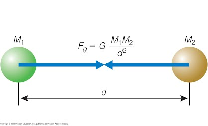

```{r setup, include=FALSE, error=FALSE, message=FALSE, warning=FALSE}
knitr::opts_chunk$set(echo = FALSE, 
                      error = FALSE, message = FALSE, 
                      tinytex.verbose = TRUE)

library(knitr)
library(ggplot2)
library(showtext)
library(magrittr)
```

\newpage

**`r ifelse(echoTF == TRUE, "Answers to ", "") `Questions: **

First, load your libraries!

```{r, echo = TRUE, eval = TRUE}
library(tidyverse)
library(here)
library(janitor)
```


NOTE: For this homework, also refer to the PDF version. 
There are helpful graphics included in the PDF version!

# Functions

Though you can use funtions to automate processes like we did in the coursework, I am going to take a slightly different take here and focus of using functions for, well, mathimatical functions! 

## The Pythagorean Theorem

$$a^{2} + b^{2} = c^{2}$$

Where: 

 - $a$ is the length of leg A
 - $b$ is leg length of leg B
 - $c$ is the length of leg C, otherwise known as the hypotenuse


```{r, echo = FALSE}
col_col <- c("#000000",'#000000')
col_fill <- c("#5cb85c","#f9f9f9")
d <- data.frame(x=c(1,5,5), 
             y=c(1,1,3), 
             t=c('a', 'a', 'a'), 
             x.r = c(3, 5.1, 3), 
             y.r = c(0.9, 2, 2.1),
             r=c('A','B','C'))

p <- ggplot(data = d, 
            aes(x = x, 
                y = y, 
                col = factor(t), 
                fill = factor(t))) + 
  geom_polygon(data = d, alpha = .75) + 
       scale_color_manual(values = col_col) + 
  scale_fill_manual(values = col_fill) 
p <- p + geom_point(data = d[1:3,]) + 
  geom_text(data = d, 
            aes(x=x.r, 
                y=y.r, 
                label=r),
            size=6) +
    theme(axis.title.x = element_blank(),
          axis.ticks.x = element_blank(),
          axis.ticks.y = element_blank(),
          legend.position = 'none')

p
```

Solve for $c$ and include {roxygen2} skeletons!

Let:
 - $a$ = `c(5,3,10,4)` 
 - $b$ = `c(3,5,10,20)`

```{r, echo = echoTF,eval=echoTF}

#' The Pythagorean Theorem
#'
#' @param a1 A numberic or a vector. The first leg of a right triangle. 
#' @param b1 A numberic or a vector. The second leg of a right triangle. 
#'
#' @return A numeric or a vector. The hypotenuse of the triangle. 
#' @export
#'
#' @examples
#' pythagoreanTheorem(a1 = 5, b1 = 3)
pythagoreanTheorem <- function(a1, b1) {
  
  c2 <- a1^2 + b1^2
  
  c0 <- c2^(1/2) # could also use sqrt()
  
  return(c0)
}

a <- c(5,3,10,4) 
b <- c(3,5,10,20)
pythagoreanTheorem(a1 = a, b1 = b)

```


## Newton's Universal Law of Gravitation

```{r, echo = FALSE}
# url <- "https://sites.google.com/site/oakastroflash/_/rsrc/1238267876560/Home/laws-of-physics/newton-s-universal-law-of-gravity/04_16Figure-Unanno.jpg?height=254&width=420"
```

$$F = G \frac{m_1 m_2}{d^2}$$

Where: 

 - $F$	=	force
 - $G$	=	gravitational constant ($6.67430*10^{-11}$)
 - $m_1$	=	mass of object 1
 - $m_2$	=	mass of object 2
 - $r$	=	distance between centers of the masses



### Solve for force ($F$) and include {roxygen2} skeletons:

Let:
 - the mass of object 1 (m_1) = 5, 
 - the mass of object 2 (m_2) = 3, and 
 - distance between the two masses (d) = 2. 
 

> Hint! The Gravitational Constant Shouldn't change, unless you are testing this out on other planets. To save time, add the gravitational constant on earth to where you define the arguments in your function. 

```{r, echo = echoTF,eval=echoTF }
#' Calculate Newton's Universal Law of Gravitation
#'
#' @param G0 A numeric or a vector. The gravitational constant. The default is 6.67430*10^-11. 
#' @param m_1 A numeric or a vector. Mass of the first object. 
#' @param m_2 A numeric or a vector. Mass of the second object. 
#' @param d2 A numeric or a vector. distance between centers of the masses. 
#'
#' @return A numeric or a vector. The force. 
#' @export
#'
#' @examples
#' NewtonGrav(m_1 = 5, m_2 = 3, d2 = 2)
NewtonGrav <- function(G0 = 6.67430*10^-11, 
                       m_1, 
                       m_2, 
                       d2){
  
  F1 = G0 * (m_1*m_2)/d2
  
  return(F1)
}

NewtonGrav(m_1 = 5, 
           m_2 = 3, 
           d2 = 2)

```


## Area Swept (from our surveys!)

```{r, echo =FALSE}
col_col <- c("#000000",'#000000')
col_fill <- c("#5cb85c","#f9f9f9")
d <- data.frame(x=c(0,0,10,10), 
             y=c(0,0.001,0.001,0), 
             t=c('a', 'a', 'a', 'a'), 
             x.r = c(5, 10.4, 5, 0.5), 
             y.r = c(.0005, .0005, -0.0001, 0.0011),
             r=c('A','D','W', "[boat haul end]"))
p <- ggplot(data = d, 
            aes(x = x, 
                y = y, 
                col = factor(t), 
                fill = factor(t))) + 
  geom_polygon(data = d, alpha = .75) + 
       scale_color_manual(values = col_col) + 
  scale_fill_manual(values = col_fill) 
p <- p + geom_point(data = d[1:3,]) + 
  geom_text(data = d, 
            aes(x=x.r, 
                y=y.r, 
                label=r),
            size=6) +
    theme(axis.title.x = element_blank(),
          # axis.text.x  = element_blank(),
          axis.ticks.x = element_blank(),
          # axis.title.y = element_blank(),
          # axis.text.y  = element_blank(),
          axis.ticks.y = element_blank(),
          legend.position = 'none') +
  geom_segment(aes(x = -0.5, y = 0, 
                   xend = -0.5, yend = 0.001),
                  arrow = arrow(length = unit(1, "cm")))

p
```

This is the area sampled for each observation when we survey. Often we can assume this number is low (e.g., 0.001). In our case, we need to add some conversions to make this useful to the survey outputs. Here I'll write without variables to make it easier to read:

$$Area Swept (km^2) = Distance Fished (hectare) * (Net Width (m) * 0.001 (\frac{km}{m}) ) * 100 (\frac{km}{hectare})$$

But for writing our function, we'll simplify to the core of this equation:

$$area = distance * width$$

### Write a function for this equation and solve for $Area Swept (km^2)$. 

Let:
 - a0 = Area, 
 - d0 = Distance (.001), 
 - w0 = Width (10). 
 
Solve for Area (a0) and include {roxygen2} skeletons. 

```{r, echo = echoTF,eval=echoTF}

#' Area Swept
#'
#' @param d0 A numeric or a vector. distnace of survey.
#' @param w0 A numeric or a vector. Width of net.
#'
#' @return
#' @export
#'
#' @examples AreaSwept(d0 = .001, w0 = 10)
AreaSwept<-function(d0, w0) {
  a0<-d0*(w0*0.001)*100
  return(a0)
}

AreaSwept(d0 = .001, w0 = 10)
```


### Now we will apply this function to some real data! Here I've combined two datasets, *haul* and *catch* for Eastern Bering Sea data (people familiar with the survey data on Oracle will know what this means). 

```{r, echo = TRUE}
EBS<-read_csv(file = here("data", "haul_catch.csv"))
EBS<-janitor::clean_names(EBS)
EBS_summary <- EBS %>% 
  dplyr::filter(year == 2017) %>%
  dplyr::select(stratum, haul, distance_fished, net_width)

head(EBS_summary)
str(EBS_summary)
```


```{r, echo = echoTF,eval=echoTF}
EBS_summary$area_swept<-AreaSwept(d0 = EBS_summary$distance_fished, 
                                 w0 = EBS_summary$net_width)
summary(EBS_summary)

str(EBS_summary)
```

## Catch Per Unit Effort (CPUE)

CPUE is calculated by dividing the catch of each fishing trip by the number of hours fished during that trip. This gives CPUE in units of kilograms per hour.

$$CPUE = \frac{Catch_{trips}(kg)}{time_{trips}(hr)}$$

Write a function for this equation and solve for $CPUE$ using the below data. 

```{r, echo = TRUE}
EBS<-read_csv(file = here("data", "haul_catch.csv"))
EBS<-janitor::clean_names(EBS)
EBS_summary <- EBS %>% 
  dplyr::filter(year == 2017) %>%
  dplyr::select(stratum, haul, duration, net_width)

head(EBS_summary)
str(EBS_summary)
```

Let
 - catch = catch from the survey (catch = EBS$number_fish), 
 - time = time in hours from the survey (EBS$duration), 
 - trips = number of trips taken during survey (EBS$haul). 
 
Solve for CPUE (CPUE) and include {roxygen2} skeleton. 

> Hint: This question is meant to challenge you. You'll need to use an for loop to cycle through unique trips. 

```{r, echo = echoTF,eval=echoTF}

#' Calculate CPUE of Survey
#'
#' @param catch A numeric or a vector. Catch from the fishing trip.  
#' @param time A numeric or a vector. Time in hours. Number of hours fished during that trip. 
#' @param trips 
#'
#' @return A numeric or a vector of CPUE. 
#' @export
#'
#' @examples
#' CPUE0<-CPUE(trips = 3, 
#'            time = 100, 
#'            catch = 1000)
CPUE <- function(catch, time, trips){

  trip_unq<-unique(trips)
  CPUE0 <- data.frame(TRIP = trip_unq, 
                      CPUE = NA)
  
  for (i in 1:length(trip_unq)) {
    trip_idx<-which(trips %in% trip_unq[i])
    CPUE0$CPUE[i]<-sum(catch[trip_idx])/sum(time[trip_idx])
  }
  
  return(CPUE0)
}

CPUE0<-CPUE(trips = EBS$HAUL, 
            time = EBS$DURATION, 
            catch = EBS$NUMBER_FISH)

head(CPUE0)

```

